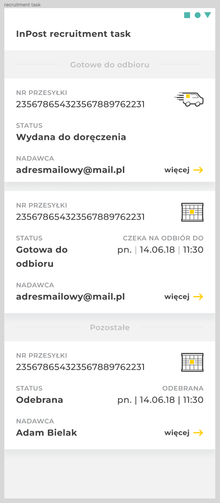

# InPost Recruitment Task

## Intro
We travel back in time ⏱️. InPost Mobile app was just created and you join the team to improve its feature set and make it ready for the future.
User base is growing fast and every day more people start to use it daily.

You, as an experienced developer, were assigned to the project to improve its quality. The initial code is not perfect and is far from being.
Organize and refactor code the way you like to work (packages, modules, layers, data flow, names, methods order etc.).

## Rules
- You can change and move any part you like, install any open source library you want
- A static JSON file is returned in response, **consider this is a real production environment** returning your data
- JSON file cannot be changed
- Git history is also important
- Feel free to comment your choices

## Tasks
1. Add grouping to the list of Shipments by flag **ShipmentNetwork.operations.highlight**
2. Style list items as in Figma (link: https://www.figma.com/file/MzPR3whRl6KB1fFnkyM6Or/recruitment-task)
3. Sort list items in groups by (the closest date to current date should be at top of the list):
    * status - order is described in `ShipmentStatus.kt` file (first item, should be at the top of list)
    * pickupDate
    * expireDate
    * storedDate
    * number
4. Add pull to refresh and handle refresh progress
5. Add storing shipments locally (use Room)
6. Add local archiving of the shipment:
    * We consider archiving as hiding the shipment from the list of `Shipment`s
    * Design is not important here
    * `Shipment` must stay hidden after re-downloading data or relaunching the app
7. Create unit tests

## Links and resources
- Fonts folder: [/app/src/main/res/font](./app/src/main/res/font)

If for some reason Figma link stops working, here you can see the requested design:

# Good luck! 💪
